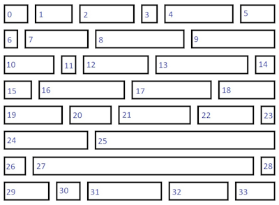
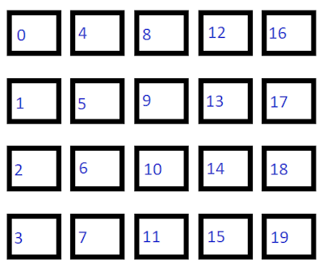
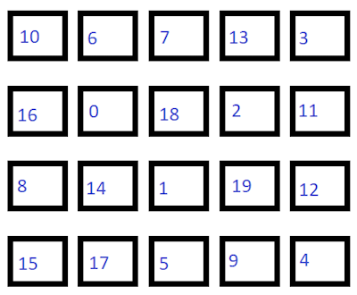

# Microsoft.UI.Xaml.Controls.Layout.IndexBasedLayoutOrientation

<!--
public Microsoft.UI.Xaml.Controls.IndexBasedLayoutOrientation IndexBasedLayoutOrientation { get; }
-->

## -description

Gets the orientation, if any, in which items are laid out based on their index in the source collection.

## -property-value

A value of the enumeration that indicates the orientation, if any, in which items are laid out based on their index in the source collection. The default is `None` (see Remarks).

## -remarks

Each `Layout`-derived class can specify it's own default value for this property. Both [NonVirtualizingLayout](nonvirtualizinglayout.md) and [VirtualizingLayout](virtualizinglayout.md) specify [IndexBasedLayoutOrientation.None](indexbasedlayoutorientation.md) as the default. [LinedFlowLayout](linedflowlayout.md) specifies `LeftToRight`. Custom layouts call the protected [SetIndexBasedLayoutOrientation](layout_setindexbasedlayoutorientation_190869409.md) method to set the value of this property.

You can use the `IndexBasedLayoutOrientation` property to determine if the item at index `N+1` is to the right or below the item at index `N` (or neither). This allows a control such as [ItemsView](itemsview.md) to correctly implement keyboard navigation with the arrow keys.

The `IndexBasedLayoutOrientation` property has no effect on the `Layout` per se. Instead, it can have an effect on controls that consume the `Layout`, like the [ItemsView](itemsview.md) control. The `ItemsView` uses the value of this property in its internal implementation of its [TryGetItemIndex](itemsview_trygetitemindex_610807935.md) method and its built-in handling of keyboard-based navigation.

For example, the [LinedFlowLayout](linedflowlayout.md) layout specifies `LeftToRight`. As a result, right-arrow and left-arrow keys move to an item based on its index. The right-arrow key navigates to the next index (moving from index `N` to index `N+1`). The left-arrow key navigates to the previous index (moving from index `N` to index `N-1`). On the other hand, the up-arrow and down-arrow keys move to an item based on its physical position.

When `IndexBasedLayoutOrientation` is `TopToBottom`, the behaviors are reversed.

When `IndexBasedLayoutOrientation` is `None`, all four arrow keys move to an item based on its physical location, rather than its index.

The illustrations in this table visually represent the possible values of `IndexBasedLayoutOrientation`.

| **`IndexBasedLayoutOrientation`** | **Illustration** |
|-|-|
| **`LeftToRight`**  Items are laid out horizontally with increasing indices. |  |
| **`TopToBottom`** Items are laid out vertically with increasing indices. |  |
| **`None`** There is no correlation between the items' layout and their index number. |  |

## -see-also

[SetIndexBasedLayoutOrientation](layout_setindexbasedlayoutorientation_190869409.md)

## -examples
