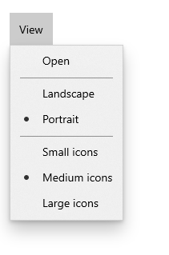

# Microsoft.UI.Xaml.Controls.RadioMenuFlyoutItem.GroupName

<!--
public string GroupName { get; set; }
-->

## -description
Gets or sets the name that specifies which RadioMenuFlyoutItem controls are mutually exclusive.

## -property-value

## -remarks
This property is optional. All RadioMenuFlyoutItems with the default (empty) GroupName will be in the same group.

## -see-also

## -examples
Radio menu flyout items work in groups, and users can only select one item in a radio menu flyout item group. To create multiple groups of radio buttons within a single menu, be sure to specify the `GroupName` property of each set.



```xaml
<MenuBar>
    <MenuBarItem Title="View">
        <MenuFlyoutItem Text="Open"/>
        <MenuFlyoutSeparator/>
        <RadioMenuFlyoutItem Text="Landscape" GroupName="OrientationGroup"/>
        <RadioMenuFlyoutItem Text="Portrait" GroupName="OrientationGroup" IsChecked="True"/>
        <MenuFlyoutSeparator/>
        <RadioMenuFlyoutItem Text="Small icons" GroupName="SizeGroup"/>
        <RadioMenuFlyoutItem Text="Medium icons" IsChecked="True" GroupName="SizeGroup"/>
        <RadioMenuFlyoutItem Text="Large icons" GroupName="SizeGroup"/>
    </MenuBarItem>
</MenuBar>
```
