<!-- Enumeration syntax
public enum Windows.UI.Xaml.Controls.Symbol : int
-->

# Symbol

## -description
Defines constants that specify a glyph from the font defined by the `SymbolThemeFontFamily` resource.

## -xaml-syntax
```xaml
<SymbolIcon Symbol="enumMemberName"/>
```

## -enum-fields

### -field Previous:57600
E892 &nbsp;&nbsp;

### -field Next:57601
E893 &nbsp;&nbsp;

### -field Play:57602
E768 &nbsp;&nbsp;

### -field Pause:57603
E769 &nbsp;&nbsp;

### -field Edit:57604
E70F &nbsp;&nbsp;

### -field Save:57605
E74E &nbsp;&nbsp;

### -field Clear:57606
E894 &nbsp;&nbsp;

### -field Delete:57607
E74D &nbsp;&nbsp;

### -field Remove:57608
E738 &nbsp;&nbsp;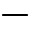

### -field Add:57609
E710 &nbsp;&nbsp;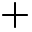

### -field Cancel:57610
E711 &nbsp;&nbsp;

### -field Accept:57611
E8FB &nbsp;&nbsp;

### -field More:57612
E712 &nbsp;&nbsp;

### -field Redo:57613
E7A6 &nbsp;&nbsp;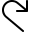

### -field Undo:57614
E7A7 &nbsp;&nbsp;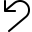

### -field Home:57615
E80F &nbsp;&nbsp;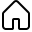

### -field Up:57616
E74A &nbsp;&nbsp;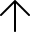

### -field Forward:57617
E72A &nbsp;&nbsp;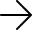

### -field Back:57618
E72B &nbsp;&nbsp;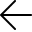

### -field Favorite:57619
E734 &nbsp;&nbsp;

### -field Camera:57620
E722 &nbsp;&nbsp;

### -field Setting:57621
E713 &nbsp;&nbsp;

### -field Video:57622
E714 &nbsp;&nbsp;

### -field Sync:57623
E895 &nbsp;&nbsp;

### -field Download:57624
E896 &nbsp;&nbsp;

### -field Mail:57625
E715 &nbsp;&nbsp;

### -field Find:57626
E721 &nbsp;&nbsp;

### -field Help:57627
E897 &nbsp;&nbsp;

### -field Upload:57628
E898 &nbsp;&nbsp;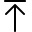

### -field Emoji:57629
E899 &nbsp;&nbsp;

### -field TwoPage:57630
E89A &nbsp;&nbsp;

### -field LeaveChat:57631
E89B &nbsp;&nbsp;

### -field MailForward:57632
E89C &nbsp;&nbsp;

### -field Clock:57633
E823 &nbsp;&nbsp;

### -field Send:57634
E724 &nbsp;&nbsp;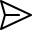

### -field Crop:57635
E7A8 &nbsp;&nbsp;

### -field RotateCamera:57636
E89E &nbsp;&nbsp;

### -field People:57637
E716 &nbsp;&nbsp;

### -field OpenPane:57638
E8A0 &nbsp;&nbsp;

### -field ClosePane:57639
E89F &nbsp;&nbsp;

### -field World:57640
E909 &nbsp;&nbsp;

### -field Flag:57641
E7C1 &nbsp;&nbsp;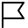

### -field PreviewLink:57642
E8A1 &nbsp;&nbsp;

### -field Globe:57643
E774 &nbsp;&nbsp;

### -field Trim:57644
E78A &nbsp;&nbsp;

### -field AttachCamera:57645
E8A2 &nbsp;&nbsp;

### -field ZoomIn:57646
E8A3 &nbsp;&nbsp;

### -field Bookmarks:57647
E8A4 &nbsp;&nbsp;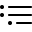

### -field Document:57648
E8A5 &nbsp;&nbsp;

### -field ProtectedDocument:57649
E8A6 &nbsp;&nbsp;

### -field Page:57650
E729 &nbsp;&nbsp;

### -field Bullets:57651
E8FD &nbsp;&nbsp;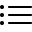

### -field Comment:57652
E90A &nbsp;&nbsp;

### -field MailFilled:57653
E8A8 &nbsp;&nbsp;

### -field ContactInfo:57654
E779 &nbsp;&nbsp;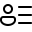

### -field HangUp:57655
E778 &nbsp;&nbsp;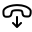

### -field ViewAll:57656
E8A9 &nbsp;&nbsp;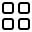F
### -field MapPin:57657
E7B7 &nbsp;&nbsp;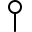

### -field Phone:57658
E717 &nbsp;&nbsp;

### -field VideoChat:57659
E8AA &nbsp;&nbsp;

### -field Switch:57660
E8AB &nbsp;&nbsp;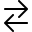

### -field Contact:57661
E77B &nbsp;&nbsp;

### -field Rename:57662
E8AC &nbsp;&nbsp;

### -field Pin:57665
E718 &nbsp;&nbsp;

### -field MusicInfo:57666
E90B &nbsp;&nbsp;

### -field Go:57667
E8AD &nbsp;&nbsp;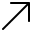

### -field Keyboard:57668
E765 &nbsp;&nbsp;

### -field DockLeft:57669
E90C &nbsp;&nbsp;

### -field DockRight:57670
E90D &nbsp;&nbsp;

### -field DockBottom:57671
E90E &nbsp;&nbsp;

### -field Remote:57672
E8AF &nbsp;&nbsp;

### -field Refresh:57673
E72C &nbsp;&nbsp;

### -field Rotate:57674
E7AD &nbsp;&nbsp;

### -field Shuffle:57675
E8B1 &nbsp;&nbsp;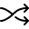

### -field List:57676
EA37 &nbsp;&nbsp;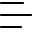

### -field Shop:57677
E719 &nbsp;&nbsp;

### -field SelectAll:57678
E8B3 &nbsp;&nbsp;

### -field Orientation:57679
E8B4 &nbsp;&nbsp;

### -field Import:57680
E8B5 &nbsp;&nbsp;

### -field ImportAll:57681
E8B6 &nbsp;&nbsp;

### -field BrowsePhotos:57685
E7C5 &nbsp;&nbsp;

### -field WebCam:57686
E8B8 &nbsp;&nbsp;

### -field Pictures:57688
E8B9 &nbsp;&nbsp;

### -field SaveLocal:57689
E78C &nbsp;&nbsp;

### -field Caption:57690
E8BA &nbsp;&nbsp;

### -field Stop:57691
E71A &nbsp;&nbsp;

### -field ShowResults:57692
E8BC &nbsp;&nbsp;

### -field Volume:57693
E767 &nbsp;&nbsp;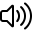

### -field Repair:57694
E90F &nbsp;&nbsp;

### -field Message:57695
E8BD &nbsp;&nbsp;

### -field Page2:57696
E7C3 &nbsp;&nbsp;

### -field CalendarDay:57697
E8BF &nbsp;&nbsp;

### -field CalendarWeek:57698
E8C0 &nbsp;&nbsp;

### -field Calendar:57699
E787 &nbsp;&nbsp;

### -field Character:57700
E8C1 &nbsp;&nbsp;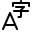

### -field MailReplyAll:57701
E8C2 &nbsp;&nbsp;

### -field Read:57702
E8C3 &nbsp;&nbsp;

### -field Link:57703
E71B &nbsp;&nbsp;

### -field Account:57704
E910 &nbsp;&nbsp;

### -field ShowBcc:57705
E8C4 &nbsp;&nbsp;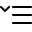

### -field HideBcc:57706
E8C5 &nbsp;&nbsp;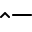

### -field Cut:57707
E8C6 &nbsp;&nbsp;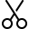

### -field Attach:57708
E723 &nbsp;&nbsp;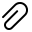

### -field Paste:57709
E77F &nbsp;&nbsp;

### -field Filter:57710
E71C &nbsp;&nbsp;

### -field Copy:57711
E8C8 &nbsp;&nbsp;

### -field Emoji2:57712
E76E &nbsp;&nbsp;

### -field Important:57713
E8C9 &nbsp;&nbsp;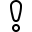

### -field MailReply:57714
E8CA &nbsp;&nbsp;

### -field SlideShow:57715
E786 &nbsp;&nbsp;

### -field Sort:57716
E8CB &nbsp;&nbsp;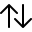

### -field Manage:57720
E912 &nbsp;&nbsp;

### -field AllApps:57721
E71D &nbsp;&nbsp;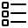

### -field DisconnectDrive:57722
E8CD &nbsp;&nbsp;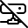

### -field MapDrive:57723
E8CE &nbsp;&nbsp;

### -field NewWindow:57724
E78B &nbsp;&nbsp;

### -field OpenWith:57725
E7AC &nbsp;&nbsp;

### -field ContactPresence:57729
E8CF &nbsp;&nbsp;

### -field Priority:57730
E8D0 &nbsp;&nbsp;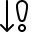

### -field GoToToday:57732
E8D1 &nbsp;&nbsp;

### -field Font:57733
E8D2 &nbsp;&nbsp;

### -field FontColor:57734
E8D3 &nbsp;&nbsp;

### -field Contact2:57735
E8D4 &nbsp;&nbsp;

### -field Folder:57736
E8B7 &nbsp;&nbsp;

### -field Audio:57737
E8D6 &nbsp;&nbsp;

### -field Placeholder:57738
E18A &nbsp;&nbsp;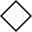

### -field View:57739
E890 &nbsp;&nbsp;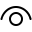

### -field SetLockScreen:57740
E7B5 &nbsp;&nbsp;

### -field SetTile:57741
E97B &nbsp;&nbsp;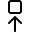

### -field ClosedCaption:57744
E7F0 &nbsp;&nbsp;

### -field StopSlideShow:57745
E620 &nbsp;&nbsp;

### -field Permissions:57746
E8D7 &nbsp;&nbsp;

### -field Highlight:57747
E7E6 &nbsp;&nbsp;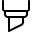

### -field DisableUpdates:57748
E8D8 &nbsp;&nbsp;

### -field UnFavorite:57749
E8D9 &nbsp;&nbsp;

### -field UnPin:57750
E77A &nbsp;&nbsp;

### -field OpenLocal:57751
E8DA &nbsp;&nbsp;

### -field Mute:57752
E74F &nbsp;&nbsp;

### -field Italic:57753
E8DB &nbsp;&nbsp;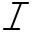

### -field Underline:57754
E8DC &nbsp;&nbsp;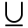

### -field Bold:57755
E8DD &nbsp;&nbsp;

### -field MoveToFolder:57756
E8DE &nbsp;&nbsp;

### -field LikeDislike:57757
E8DF &nbsp;&nbsp;

### -field Dislike:57758
E8E0 &nbsp;&nbsp;

### -field Like:57759
E8E1 &nbsp;&nbsp;

### -field AlignRight:57760
E8E2 &nbsp;&nbsp;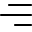

### -field AlignCenter:57761
E8E3 &nbsp;&nbsp;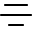

### -field AlignLeft:57762
E8E4 &nbsp;&nbsp;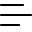

### -field Zoom:57763
E71E &nbsp;&nbsp;

### -field ZoomOut:57764
E71F &nbsp;&nbsp;

### -field OpenFile:57765
E8E5 &nbsp;&nbsp;

### -field OtherUser:57766
E7EE &nbsp;&nbsp;

### -field Admin:57767
E7EF &nbsp;&nbsp;

### -field Street:57795
E913 &nbsp;&nbsp;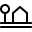

### -field Map:57796
E707 &nbsp;&nbsp;

### -field ClearSelection:57797
E8E6 &nbsp;&nbsp;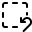

### -field FontDecrease:57798
E8E7 &nbsp;&nbsp;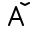

### -field FontIncrease:57799
E8E8 &nbsp;&nbsp;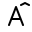

### -field FontSize:57800
E8E9 &nbsp;&nbsp;

### -field CellPhone:57801
E8EA &nbsp;&nbsp;

### -field ReShare:57802
E8EB &nbsp;&nbsp;

### -field Tag:57803
E8EC &nbsp;&nbsp;

### -field RepeatOne:57804
E8ED &nbsp;&nbsp;

### -field RepeatAll:57805
E8EE &nbsp;&nbsp;

### -field OutlineStar:57806
E734 &nbsp;&nbsp;

### -field SolidStar:57807
E735 &nbsp;&nbsp;

### -field Calculator:57808
E8EF &nbsp;&nbsp;

### -field Directions:57809
E8F0 &nbsp;&nbsp;

### -field Target:57810
F5F0

### -field Library:57811
E8F1 &nbsp;&nbsp;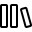

### -field PhoneBook:57812
E780 &nbsp;&nbsp;

### -field Memo:57813
E77C &nbsp;&nbsp;

### -field Microphone:57814
E720 &nbsp;&nbsp;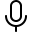

### -field PostUpdate:57815
E8F3 &nbsp;&nbsp;

### -field BackToWindow:57816
E73F &nbsp;&nbsp;

### -field FullScreen:57817
E8F3 &nbsp;&nbsp;

### -field NewFolder:57818
E8F4 &nbsp;&nbsp;

### -field CalendarReply:57819
E8F5 &nbsp;&nbsp;

### -field UnSyncFolder:57821
E8F6 &nbsp;&nbsp;

### -field ReportHacked:57822
E730 &nbsp;&nbsp;

### -field SyncFolder:57823
E8F7 &nbsp;&nbsp;

### -field BlockContact:57824
E8F8 &nbsp;&nbsp;

### -field SwitchApps:57825
E8F9 &nbsp;&nbsp;

### -field AddFriend:57826
E8FA &nbsp;&nbsp;

### -field TouchPointer:57827
E7C9 &nbsp;&nbsp;

### -field GoToStart:57828
E8FC &nbsp;&nbsp;

### -field ZeroBars:57829
E904 &nbsp;&nbsp;

### -field OneBar:57830
E905 &nbsp;&nbsp;

### -field TwoBars:57831
E906 &nbsp;&nbsp;

### -field ThreeBars:57832
E907 &nbsp;&nbsp;

### -field FourBars:57833
E908 &nbsp;&nbsp;

### -field Scan:58004
E8FE &nbsp;&nbsp;

### -field Preview:58005
E8FF &nbsp;&nbsp;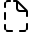

### -field GlobalNavigationButton:59136
E700 &nbsp;&nbsp;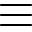

### -field Print:59209
E749 &nbsp;&nbsp;

### -field Share:59181
E72D &nbsp;&nbsp;

### -field XboxOneConsole:59792
E990 &nbsp;&nbsp;

## -remarks

The Symbol enumeration is typically used to set the value of the [AppBarButton.Icon](appbarbutton_icon.md) property or the [SymbolIcon.Symbol](symbolicon_symbol.md) property. If you would like to use a glyph from the Segoe Fluent Icon font that is not included in the Symbol enum, use a [FontIcon](fonticon.md). For more info and examples, see [Icons in Windows apps](/windows/apps/design/style/icons).

> [!TIP]
> Rather than specifying a FontFamily directly, XAML controls use the font family defined by the `SymbolThemeFontFamily` XAML theme resource. By default, this resource uses the [Segoe Fluent Icon](/windows/apps/design/style/segoe-fluent-icons-font) font. If your app is run on Windows 10, version 20H2 or earlier, the Segoe Fluent Icon font is not available and the `SymbolThemeFontFamily` resource falls back to the [Segoe MDL2 Assets](/windows/apps/design/style/segoe-ui-symbol-font) font instead.

> [!IMPORTANT]
> Windows App SDK 1.4 and earlier use glyph codes in the E1xx range, which are the same as those used by the [Windows.UI.Xaml.Controls.Symbol](/uwp/api/windows.ui.xaml.controls.symbol) enum for UWP. In Windows App SDK 1.5 and later, these glyph codes are remapped to use the newer codes shown on this page.

## -examples

## -see-also

[Icons in Windows apps](/windows/apps/design/style/icons), [Segoe Fluent Icon](/windows/apps/design/style/segoe-fluent-icons-font), [Command bar](/windows/apps/design/controls/command-bar), [AppBarButton](appbarbutton.md), [SymbolIcon](symbolicon.md)
