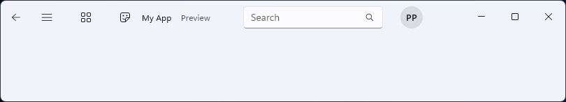

# Microsoft.UI.Xaml.Controls.TitleBar

<!--
public class TitleBar : Microsoft.UI.Xaml.Controls.Control
-->

## -xaml-syntax

```xaml
<TitleBar .../>
```

## -description

Represents a control that hosts the title text and system caption buttons for a window. It typically appears at the top of the window and includes core functionalities such as drag, minimize, maximize, and close buttons.

## -remarks

> [!TIP]
> For more info, design guidance, and code examples, see [Title bar](/windows/apps/design/controls/title-bar).

Use the `TitleBar` control to replace the default system title bar with a custom title bar that integrates with your app UI.



## -see-also

## -examples

> [!div class="nextstepaction"]
> [Open the WinUI 3 Gallery app and see the TitleBar in action](winui3gallery://item/TitleBar).

> The **WinUI 3 Gallery** app includes interactive examples of most WinUI 3 controls, features, and functionality. Get the app from the [Microsoft Store](https://www.microsoft.com/store/productId/9P3JFPWWDZRC) or get the source code on [GitHub](https://github.com/microsoft/WinUI-Gallery)

